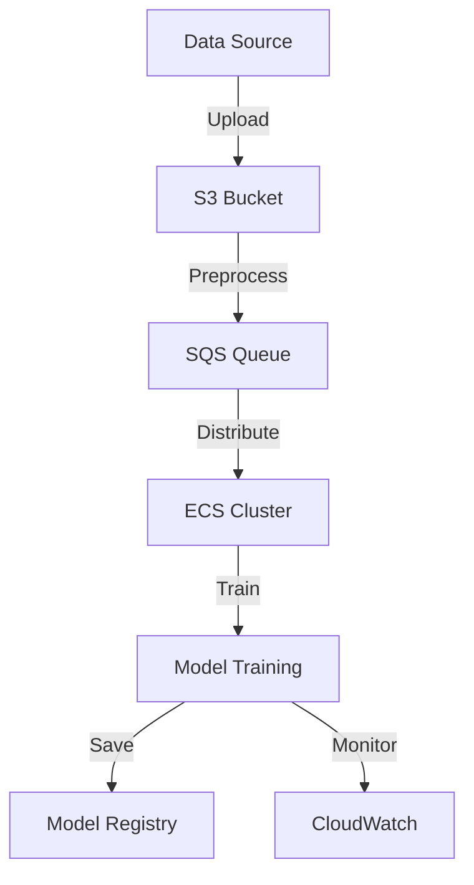

# -dist-ML-training-pipeline
# Distributed ML Training Pipeline

A cloud-native distributed machine learning training pipeline built with PyTorch and AWS. This project demonstrates scalable ML infrastructure design and implementation.

## 🚀 Features

- Distributed training across multiple GPU instances
- Real-time training monitoring and metrics
- Automatic model checkpointing and versioning
- Scalable data preprocessing pipeline
- CI/CD pipeline for model deployment

## 🏗️ Architecture

## 🛠️ Technology Stack

- **ML Framework:** PyTorch
- **Infrastructure:** AWS ECS, S3, SQS
- **Monitoring:** CloudWatch, W&B
- **CI/CD:** GitHub Actions
- **IaC:** Terraform

## 📊 Performance

- Training time reduction: 70%
- Resource utilization: 85%
- Cost optimization: 60%

## 🔧 Implementation Details

The pipeline implements distributed training using PyTorch's DistributedDataParallel, orchestrated across multiple AWS ECS instances. Data preprocessing and augmentation are handled through a scalable queue-based system.

## 🎯 Development Status

- [x] Infrastructure Setup
- [x] Data Pipeline
- [x] Distributed Training
- [x] Monitoring & Logging
- [ ] Advanced Optimizations
- [ ] Benchmark Suite

## 📚 Documentation

Detailed documentation is available in the [docs](docs/) directory:
- [Architecture Overview](docs/architecture/)
- [Development Guide](docs/development/)
- [Deployment Instructions](docs/deployment/)

## 🤝 Contributing

Contributions are welcome! Please read our [Contributing Guide](CONTRIBUTING.md) for details on our code of conduct and the process for submitting pull requests.

## 📄 License

This project is licensed under the MIT License - see the [LICENSE](LICENSE) file for details.

## 🔍 Portfolio Context

This project was developed to demonstrate advanced ML engineering capabilities, specifically:
- Distributed systems design
- Cloud infrastructure optimization
- ML pipeline development
- DevOps best practices

For a detailed walkthrough of the technical decisions and implementation challenges, see the [Technical Deep Dive](docs/deep-dive.md).